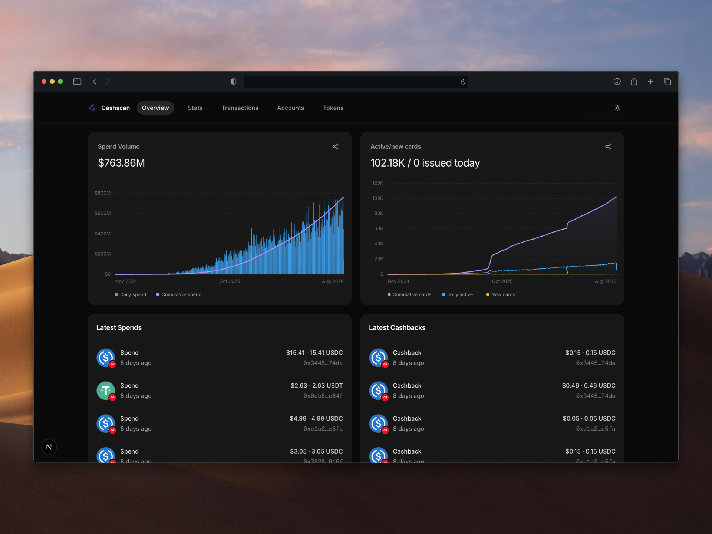

# Ether.fi Cash Scanner

A pnpm/Turborepo workspace for maintaining an Ether.fi Cash destination ledger with Envio HyperIndex and exploring the indexed data through Next.js.



## Workspace

- `apps/indexer` — Envio v3 indexer for destination top-ups and settled spend on Optimism and Scroll, including legacy Scroll history.
- `apps/web` — Next.js scanner backed strictly by Envio GraphQL, using the same Tailwind/shadcn design language as the neighboring Ondo app and Bklit charts for the analytics views.
- `packages/contracts` — chain-qualified deployment registry shared by the apps.
- `apps/indexer/docs/COVERAGE.md` — feature-by-feature Dune parity and enrichment boundaries.

## Requirements

- Node.js 22+
- pnpm 11+
- Docker for the local Envio database and GraphQL services

## Start locally

```bash
pnpm install
cp apps/indexer/.env.example apps/indexer/.env
cp apps/web/.env.example apps/web/.env.local
pnpm codegen
pnpm dev:indexer
```

In another terminal:

```bash
pnpm dev:web
```

### Full analytics setup

`envio dev` now creates and backfills both the raw compatibility entities and
the normalized account, pricing, and lending GraphQL entities declared in
`apps/indexer/schema.graphql`. A fresh deployment does not run a SQL migration,
Hasura metadata import, or a separate enrichment worker.

Historical effects default to dRPC and fall back to PublicNode for block-exact
same-chain prices, timestamp-aligned cross-chain price fallbacks, and Aave V4
position snapshots. Explicit archive endpoints remain first priority and are
recommended for higher limits or production deployments:

```bash
OPTIMISM_ARCHIVE_RPC_URL='https://your-optimism-archive-rpc.example' \
OPTIMISM_ARCHIVE_RPC_FALLBACK_URL='https://your-second-archive-rpc.example' \
SCROLL_ARCHIVE_RPC_URL='https://your-scroll-archive-rpc.example' \
SCROLL_ARCHIVE_RPC_FALLBACK_URL='https://your-second-scroll-archive-rpc.example' \
  pnpm dev:indexer
```

The unauthenticated Optimism PublicNode endpoint may reject archive calls;
dRPC remains the built-in historical default, and a tokenized PublicNode URL
can be supplied through `OPTIMISM_ARCHIVE_RPC_FALLBACK_URL`.

The `apps/enrichment` migration/worker commands remain only for installations
that must preserve the older `cash_explorer` SQL schema. They are not part of
fresh bootstrap. An existing Envio database created from an older schema still
requires a new schema or reset because Envio cannot retrofit newly declared
entities into an incompatible checkpoint.

Envio serves GraphQL at `http://localhost:8080/v1/graphql` by default. The scanner reads `ENVIO_GRAPHQL_URL` (server-only, preferred) or `NEXT_PUBLIC_ENVIO_GRAPHQL_URL`. If the API is unavailable, the UI shows an explicit unavailable state and never substitutes fixture or Dune data.

Useful checks:

```bash
pnpm check
pnpm test
pnpm lint
pnpm build
```

## Indexed topology

| Role | Networks | Main surface |
| --- | --- | --- |
| Destination ledger | Optimism | `TopUpDest.TopUp` credits and `CashEventEmitter.Spend` debits |
| Destination ledger + history | Scroll | Current events plus legacy `TopUp`, `TopUpBatch`, and `Spend` signatures |

Every balance is chain-qualified and keyed by destination safe and token.

## Data semantics

- `TopUpDest.TopUp` credits the destination safe and token.
- settled `Spend` debits each emitted token amount from that safe.
- every current `CashEventEmitter` event is stored, including both repayment
  variants, cashback, and the full withdrawal lifecycle.
- exact Safe wallet balances are reconstructed from ERC-20 `Transfer` logs
  filtered to dynamically registered Safe addresses; no chain-wide Transfer
  table is stored.
- account lifetime flows remain separate from current balances. Current balance
  USD uses the latest indexed price and is never inferred by subtracting
  historical USD flows.
- token metadata is resolved once per chain/address through a cached Envio RPC
  effect when absent from the verified registry. Event-emitted USD is primary;
  Optimism PriceProvider reads are cached in 15-minute buckets at exact blocks.
- Gateway and Spoke logs retain immutable provenance, correlate to one economic
  action, and materialize event-derived positions plus cached exact-block Aave
  snapshots when an archive endpoint is configured.
- repayment, cashback, withdrawal, spend-bucket, and hourly entities are available in the live GraphQL schema.

## Production notes

The configured start blocks are conservative floors, not certified creation blocks. Verify destination deployment and proxy-upgrade blocks before a production backfill.

## Sources

- [Ether.fi deployed Cash contracts](https://etherfi.gitbook.io/etherfi/developers/contracts-and-integrations/deployed-contracts#cash-contracts)
- [Ether.fi Cash v3 source](https://github.com/etherfi-protocol/cash-v3)
- [Ether.fi Cash Dune dashboard](https://dune.com/ether_fi/etherfi-cash)
- [Envio HyperIndex](https://docs.envio.dev/)
